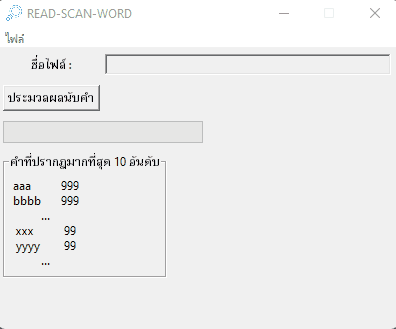

<h1 align="center">
โปรแกรมสแกนหาจำนวนคำจากไฟล์ .txt
</h1>

- แตกไฟล์
- เปิดไฟลื READ-SCAN-WORD.exe
- ทดสอบหาไฟล์ .txt ใส่ข้อความภาษาอังกฤษที่เป็นประโยคภาษาอังกฤษ

Download: <a href="https://github.com/watchakorn-18k/Read-Scan-Word/releases/download/Read-Scan-Word/Read-Scan-Word.rar">click</a>

